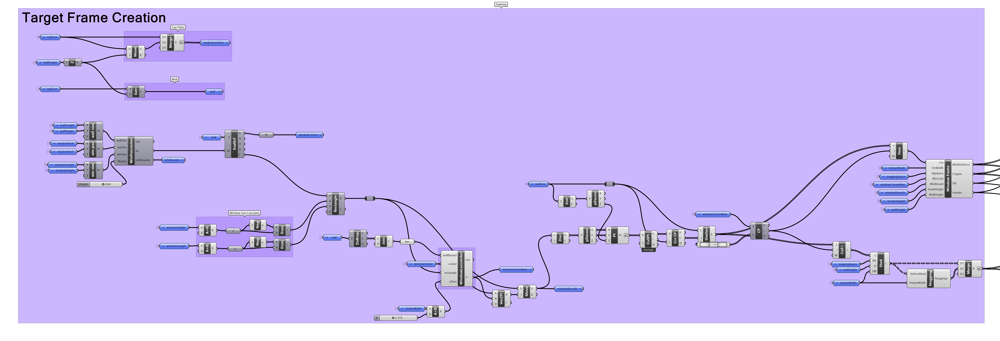

# Quick Start
Welcome to our quick start guide for constructing a basic, self-assembling timber frame structure using recycled timber with tools including [ML-Agents](https://unity-technologies.github.io/ml-agents/ML-Agents-Overview/) and [Rhino](https://www.rhino3d.com/) [Grasshopper](https://www.rhino3d.com/6/new/grasshopper/). This project demonstrates how to optimally utilize salvaged timber, reducing waste and promoting sustainability while employing advanced tools for architectural innovation.

## Setup
---
Before we begin, please make sure you have completed the following steps:
- [Setup Environment](../setup/setup_env.md)
- [Setup Unity](../setup/setup_unity.md)
- [Setup Grasshopper](../setup/setup_grasshopper.md)

## Step 1: Collect, prepare and measure salvaged timbers
---
Collect salvaged timber from a demolition site or warehouse. we recommend using timber with a rectangular cross-section. The timber should be measure to the nearest millimeter and labeled with a unique ID, this data should be recorded in `.csv` format.

## Step 2: Create a target structure
---
Create a target structure in Grasshopper by using the `Wall Frame.gh` script located at `ML-Assembly\Rhino-Grasshopper\_Scripts\Wall Frame.gh`. The script will generate a target structure (timber wall frame) with a given width, height. The script will also generate a window opening with a given width and height. The script will first output as a list of curve (length), it will then append height and width dimension for each timber and output as a list of timber IDs with their corresponding dimensions.
> Note you can also create your own target structure in Grasshopper by replacing the `Target Frame Creation` section in the `Wall Frame.gh` script with your own design. The output must be a list of curve (length).

