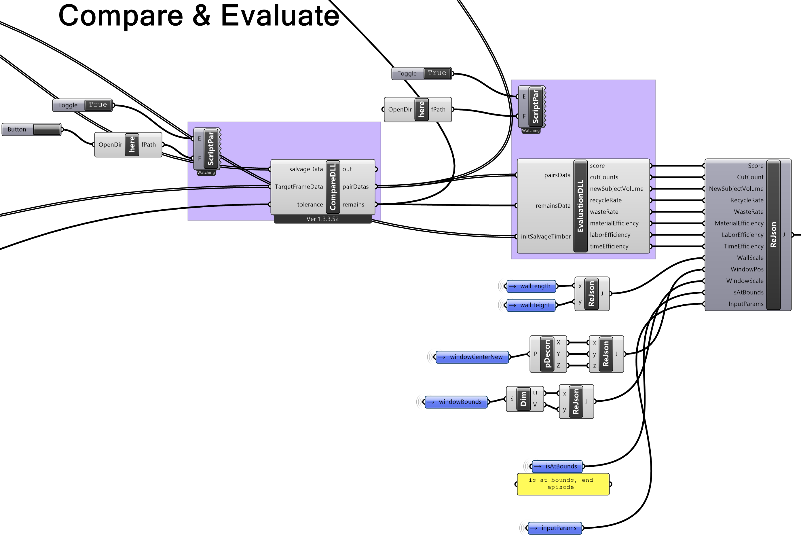
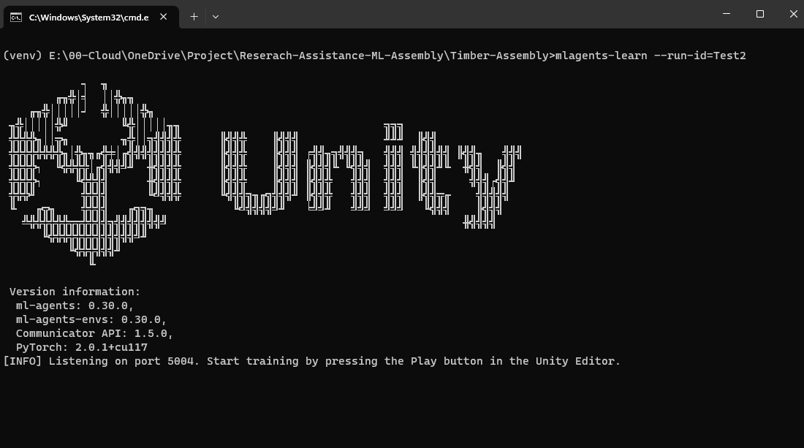

# Quick Start
Welcome to our quick start guide for constructing a basic, self-assembling timber frame structure using recycled timber with tools including [ML-Agents](https://unity-technologies.github.io/ml-agents/ML-Agents-Overview/) and [Rhino](https://www.rhino3d.com/) [Grasshopper](https://www.rhino3d.com/6/new/grasshopper/). This project demonstrates how to optimally utilize salvaged timber, reducing waste and promoting sustainability while employing advanced tools for architectural innovation.

## Setup
---
Before we begin, please make sure you have completed the following steps:
- [Setup Environment](../setup/setup_env.md)
- [Setup Unity](../setup/setup_unity.md)
- [Setup Grasshopper](../setup/setup_grasshopper.md)

## Update
---
If you have already completed the setup steps, but need to update the repository, please see [Update Repository](update.md).

## **Step 1:** Collect, prepare and measure salvaged timbers
---
Collect salvaged timber from a demolition site or warehouse. we recommend using timber with a rectangular cross-section. The timber should be measure to the nearest millimeter and labeled with a unique ID, this data should be recorded in `.csv` format.

## **Step 2:** Create a target structure
---
Create a target structure in Grasshopper by using the `Wall Frame.gh` script located at `ML-Assembly\Rhino-Grasshopper\_Scripts\Wall Frame.gh`. The script will generate a target structure (timber wall frame) with a given width, height. The script will also generate a window opening with a given width and height. The script will first output as a list of curve (length), it will then append height and width dimension for each timber and output as a list of timber IDs with their corresponding dimensions.
> Note you can also create your own target structure in Grasshopper by replacing the `Target Frame Creation` section in the `Wall Frame.gh` script with your own design. The output must be a list of curve (length).


## **Step 3:** Import collected salvaged timbers data into Grasshopper
---
Locate the `Data Reader` section of the grasshopper script and replace the `Data Path` with the path to your salvaged timber data. The data should be in `.csv` format with the following columns: `ID`, `Length`, `Width`, `Height`. The data should be in the same format as the sample data located at `ML-Assembly\Rhino-Grasshopper\Data\Data.csv`.

The data will be converted into a list of JSON objects and output as a list of timber IDs with their corresponding dimensions.

##### Sample CSV Data
| ID | Length | Width | Height |
| --- | --- | --- | --- |
| T01 | 1000 | 100 | 100 |
| T02 | 3000 | 200 | 200 |
| T03 | 5050 | 500 | 300 |
| ... | ... | ... | ... |

##### Sample JSON Data
```
[
    {
        "ID": "T01",
        "Dimension": {
            "X": 1000,
            "Y": 100,
            "Z": 100
        }
    },
    {
        "ID": "T02",
        "Dimension": {
            "X": 3000,
            "Y": 200,
            "Z": 200
        }
    },
    {
        "ID": "T03",
        "Dimension": {
            "X": 5050,
            "Y": 500,
            "Z": 300
        }
    },
    ...
]
```

## **Step 4:** Compare and evaluate target structure against Salvaged timbers
---
Locate the `Compare & Evaluate` section of the script. The `CompareDLL` and `EvaluationDLL` components should be white. If not, please refer to [Setup Grasshopper](../setup/setup_grasshopper.md).

The `CompareDLL` component takes in the target structure and salvaged timber data as `JSON objects` and outputs a list of [Pairs](../../api/TimberAssembly.Entities.Pair.yml) with timber IDs and their corresponding dimensions along with a list of [Remains](../../api/TimberAssembly.Entities.Remain.yml) which contains salvaged timber that are not able to matched. The `CompareDLL` will also trim the salvage timbers to the length of the target structure or add a new timber to the list if the target structure is longer than the salvaged timber and that there is no suitable combination of salvaged timbers that can be used to construct the target structure.

The `EvaluationDLL` component takes in the output from the `CompareDLL` which are a list of [Pairs](../../api/TimberAssembly.Entities.Pair.yml) with timber IDs and their corresponding dimensions along with a list of [Remains](../../api/TimberAssembly.Entities.Remain.yml), it will also takes initial salvage timber that are pre-matched in `initSalvageTimber` parameter. The `EvaluationDLL` will then evaluate and output 
[cutCount](xref:TimberAssembly.Operation.Evaluate.EvaluateEfficiencyByCutCount), 
[newSubjectVolume](xref:TimberAssembly.Operation.Evaluate.EvaluateEfficiencyByVolume), 
[recycleRate](xref:TimberAssembly.Operation.Evaluate.GetRecycleRateVolume), 
[wasteRate](xref:TimberAssembly.Operation.Evaluate.GetWasteRateByVolume), 
[materialEfficiency](xref:TimberAssembly.Operation.Evaluate.EvaluateEfficiencyByVolume),
[laborEfficiency](xref:TimberAssembly.Operation.Evaluate.EvaluateEfficiencyByCutCount), 
[timeEfficiency](xref:TimberAssembly.Operation.Evaluate.EvaluateEfficiencyByTime(System.Double,System.Double)).



## **Step 5:** Package data for Unity
---
Locate the `ReJson` component and input the output from the `EvaluateDLL` along with other information for the ML-Agent to observe. The `ReJson` component will then output a single JSON object. This JSON object will then be send to Unity for the ML-Agent to observe via the `UDP Sender` component (with default port at `6001`).

## **Step 6:** Run Unity
---
Open the `ML-Assembly\Timber-Assembly` project in Unity and run the `ghLiveLink` scene.

## **Step 7:** Run ML-Agent
---
Open the `ML-Assembly\Timber-Assembly` directory, and open a terminal window. Run the following command to start the ML-Agent:

Start the virtual environment
```
venv\Scripts\activate
```

Start the ML-Agent
```
mlagents-learn --run-id=Test
```
Once the ML-Agent is running, you should see the following output:
```
[INFO] Listening on port 5004. Start training by pressing the Play button in the Unity Editor.
```



At this point you can press the play button in Unity to start the training process. The ML-Agent will create action and send a `csv` string to Grasshopper via the UDP protocol (with default port at `6000`) and wait for a response from Grasshopper. Grasshopper will recieve action from ML-Agent and update the environment, then it will send a JSON object back to the ML-Agent via the UDP protocol (with default port at `6001`). The ML-Agent will then use the JSON object recieved to observe and update action and repeat the process.

> Note: For the training to continue running, the Unity window must be both active and placed at the forefront. If the window is minimized, de-prioritized, or not the active window on your screen, the training process will pause until Unity is once again the primary active window. It's essential to keep this window open and focused to ensure uninterrupted training.

> If you encounter the following error:
> ```
> "Previous data from this run ID was found."
> ```
> Use a different `run-id` or override the previous data by adding the `--force` flag:
> ```
> mlagents-learn --run-id=Test --force
> ```