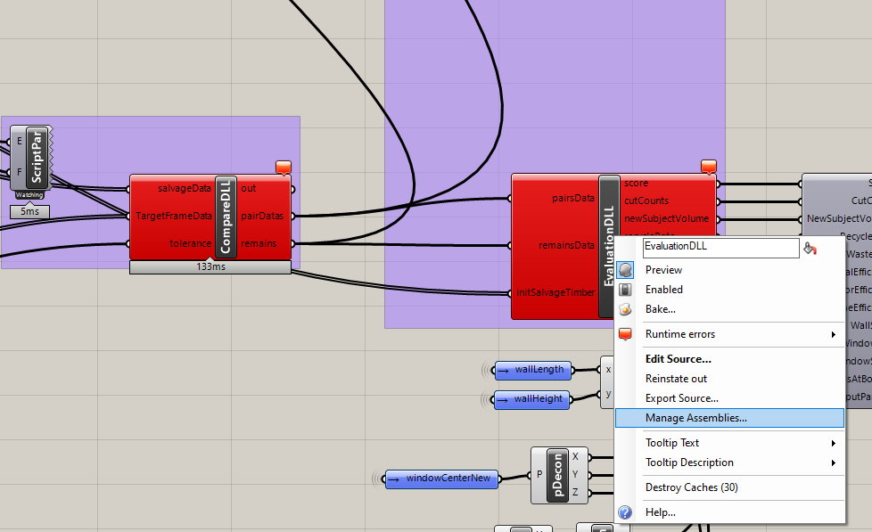

# Setup Grasshopper
## Pre-requisites grasshopper plugins
- [Telepathy](https://www.food4rhino.com/app/telepathy)
- [gHowl](https://www.food4rhino.com/app/ghowl)
- [ScriptParasite](https://www.food4rhino.com/app/scriptparasite)
- [jSwan](https://www.food4rhino.com/app/jswan)
- [Elefront](https://www.food4rhino.com/app/elefront)
- [Heteroptera](https://www.food4rhino.com/app/heteroptera)

## Install `TimberAssembly.dll`
1. Download the [latest release]((https://github.com/sean1832/ML-Assembly/releases/latest)) of `TimberAssembly.dll`. It should be a .zip file containing `TimberAssembly.dll` and its dependencies. *(Note that you will need to download the .dll again if you want to update it.)*
2. Extract the .zip file to a folder on your local machine.
3. Open Rhino 7 and Grasshopper.
4. In Grasshopper, open the grasshopper script `Wall Frame.gh` located at `ML-Assembly\Rhino-Grasshopper\_Scripts\Wall Frame.gh`.
5. Navigate to `CompareDLL` and `EvaluationDLL` components which both should be red. Right click on them. Select `Manage Assemblies...`.

1. In the `Manage Assemblies` window, click on `Add...` and navigate to the folder where you extracted the .zip file. Select `TimberAssembly.dll` and click `Open`.
2. Repeat step 6 for `CompareDLL` and `EvaluationDLL` components.
> At this point, the `CompareDLL` and `EvaluationDLL` components should be white. If not, try restarting Rhino 7 and Grasshopper. Otherwise, please submit an issue [here](https://github.com/sean1832/ML-Assembly/issues).

## Next steps
- [**Quick start**](../get_started/quick_start.md)