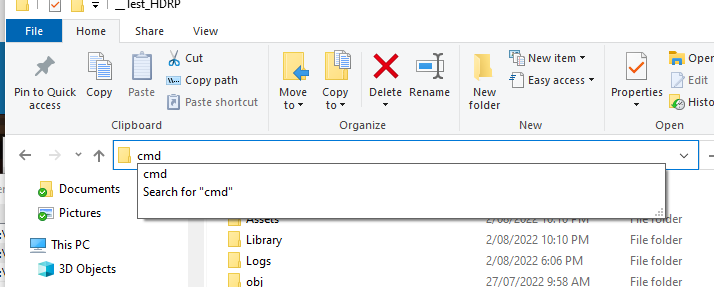

# Research-Assistance-ML-Assembly

## Pre-Requirements

1. [Python 3.9.7](https://www.python.org/downloads/release/python-379/)
1. [CUDA Toolkit 11.8](https://developer.nvidia.com/cuda-downloads)
## Setup Project
### Step 0: Clone project file to local machine
- Install [GitHub Desktop](https://desktop.github.com/)
- In Github Desktop, click Clone Repository
- Enter URL `https://github.com/sean1832/Research-Assistance-ML-Assembly.git`
- Set local path to clone

### Step 1: Create python virtural environment
- Under project root directory, open command prompt

- Create virtural envrionment by enter `python -m venv venv`

### Step 2: Activate the virtural environment and update pip
- Activate virtural envrionment by enter `venv\Scripts\activate`
- Update pip to latest version by enter `python -m pip install --upgrade pip`

### Step 3: Install ML-Agent Python packages
- Install PyTorch by enter `pip3 install torch~=1.7.1 -f https://download.pytorch.org/whl/torch_stable.html`
- Install ML-Agent by enter `pip install mlagents`

### Step 4: Install ML-Agent Unity package
- Inside package manager, under Unity Registry, Search `ml agents` and install
